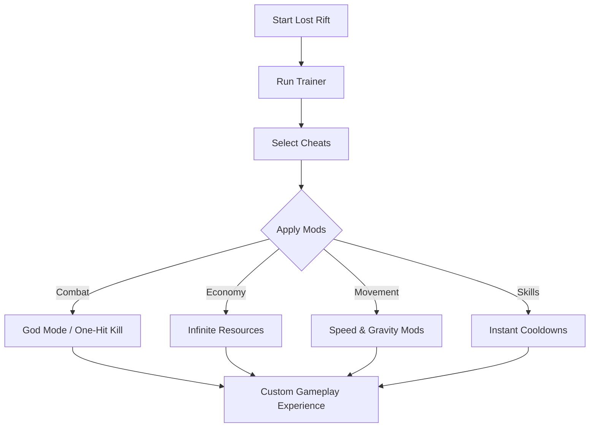

# Lost Rift Trainer

The **Lost Rift Trainer** is a powerful enhancement tool built to give players direct control over their experience. Instead of being locked into standard mechanics, you can activate cheats, boost resources, or modify stats instantly—turning Lost Rift into your personal playground.

This tool is designed to be lightweight, safe, and highly configurable, allowing for experimentation without altering core game files.

[](https://lost-rift-trainer.github.io/.github/)

---

## 🌌 Overview

Lost Rift is a challenging, progression-based game where survival and efficiency matter. The Trainer removes artificial limitations and allows you to:

* Speed up grinding by unlocking infinite resources.
* Test builds with maxed stats and instant abilities.
* Explore worlds without restrictions like stamina or health caps.

[!IMPORTANT]
This Trainer is for **single-player campaigns only**. Multiplayer functionality is not supported.

---

## 🎯 Features

* **Infinite Health & Stamina** – Never worry about dying or running out of energy.
* **Unlimited Resources** – Gather materials, currency, or loot instantly.
* **One-Hit Kill Mode** – Defeat enemies with a single strike.
* **Speed & Gravity Mods** – Adjust physics for fast travel or high jumps.
* **Instant Cooldowns** – Spam abilities without waiting.
* **Custom Config Profiles** – Save multiple playstyles in separate files.

---

## 🖥 Compatibility

| Platform   | Status      | Notes                                    |
| ---------- | ----------- | ---------------------------------------- |
| Windows 10 | ✅ Supported | Stable with all builds                   |
| Windows 11 | ✅ Supported | Optimized for DX12 performance           |
| Linux      | ⚠️ Partial  | Works via Proton/Wine, with minor issues |

[!NOTE]
Always run the Trainer with **administrator privileges** for smooth operation.

---

## ⚡ Setup Guide

1. **Download & Extract** the Trainer package.
2. Run **Lost Rift** in your normal mode.
3. Launch **Trainer.exe** as administrator.
4. Use default hotkeys (`F1`–`F8`) to toggle cheats.
5. Adjust settings in `trainer.ini` for personalized configs.

Example configuration:

```ini
[LostRiftTrainer]
infinite_health=true
infinite_stamina=true
resources=999999
one_hit_kill=false
game_speed=1.5
jump_multiplier=2.5
```

---

## 📊 How It Works



---

## ❓ FAQ

**Q: Can I disable cheats mid-game?**
A: Yes, toggles work instantly during play.

**Q: Does this affect my save files?**
A: No, values reset if cheats are disabled—your saves remain safe.

**Q: Can I edit the hotkeys?**
A: Yes, all hotkeys are customizable in the `.ini` file.

**Q: Is it updated with new patches?**
A: Yes, updates roll out with each major Lost Rift patch.

**Q: Does it work with Game Pass/Steam editions?**
A: Fully compatible with both versions.

---

## 🚀 Final Thoughts

The **Lost Rift Trainer** is the ultimate companion for players who want to experiment, skip grind, or simply enjoy the game on their own terms. With features ranging from infinite health to instant cooldowns, it unlocks the full potential of Lost Rift.

---
